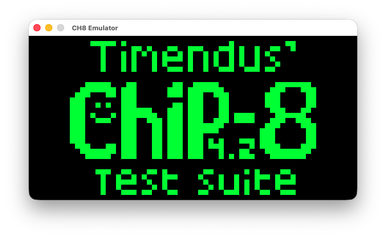
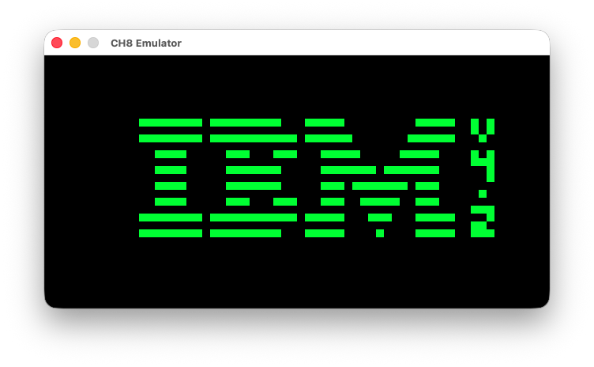
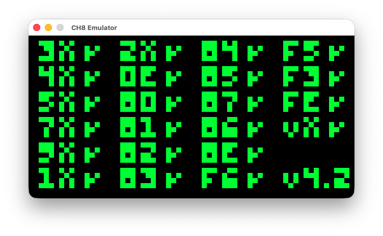
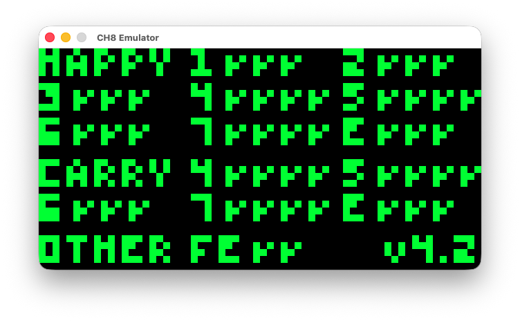
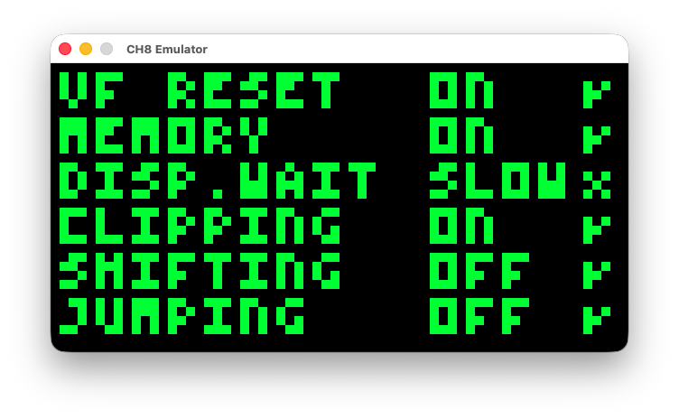
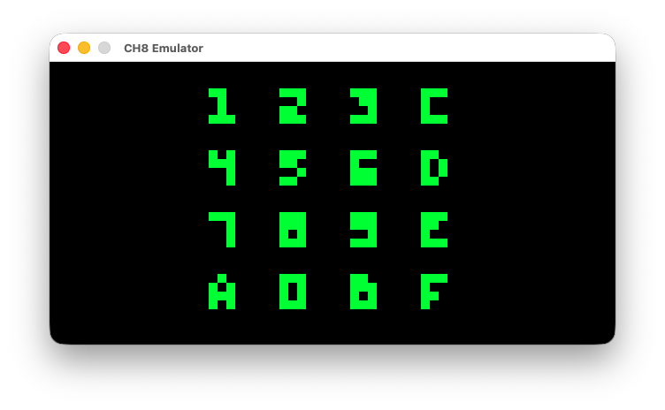
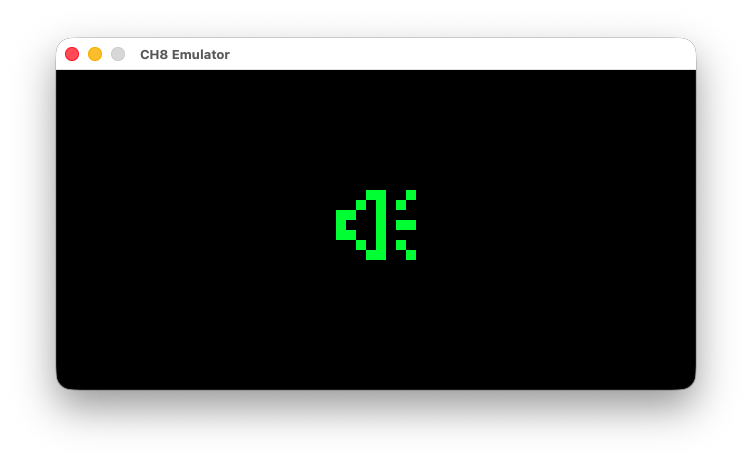

# AHRetroEmu

A retro console emulator project written in C++ / SDL3.

TOC
 * [Platforms](#platforms)
 * [Requirements](#requirements)
 * [Project Structure](#project-structure)
 * [Emulators](#emulators)

## Platforms

| Platform | Path | Description |
|----------|------|-----------|
| **macOS** | [`Build/AHRetroEmuMacOS/`](./Build/AHRetroEmuMacOS/) | macOS desktop application |
| **iOS** | [`Build/AHRetroEmuiOS/`](./Build/AHRetroEmuiOS/) | iOS mobile application |

## Requirements

- SDL3 library (release-3.4.4)
- C++ compiler
- Xcode 15.0+

## Project Structure

```
AHRetroEmu/
├── Source/              # Source files
│   ├── hello.c         # Basic SDL3 main example
│   ├── hello-callbacks.c # Basic SDL3 callbacks example
│   ├── ch8-emu-main.c  # Chip-8 emulator main
│   ├── ch8-emu.c      # Chip-8 emulator core
│   └── ch8-emu.h      # Chip-8 header
├── Resources/
│   └── Chip8/         # Chip-8 test ROMs
├── Build/
│   ├── AHRetroEmuMacOS/   # macOS Xcode project
│   └── AHRetroEmuiOS/    # iOS Xcode project
```

## Emulators

Emulators
 * [Chip-8](#chip8)

### Chip8

Reference
 * [Cowgod's Chip-8 Technical Reference](http://devernay.free.fr/hacks/chip8/C8TECH10.HTM)
 * [Guide to making a CHIP-8 emulator](https://tobiasvl.github.io/blog/write-a-chip-8-emulator/#instructions)
 * [Timendus chip8-test-suite](https://github.com/Timendus/chip8-test-suite)

Test Suite Roms Results

**1-chip8-logo.ch8**: Passed


**2-ibm-logo.ch8**: Passed


**3-corax+.ch8**: Passed


**4-flags.ch8**: Passed


**5-quirks.ch8**: SLOW Passed


**6-keypad.ch8**: Failed


**7-beep.ch8**: Passed


## License

MIT License